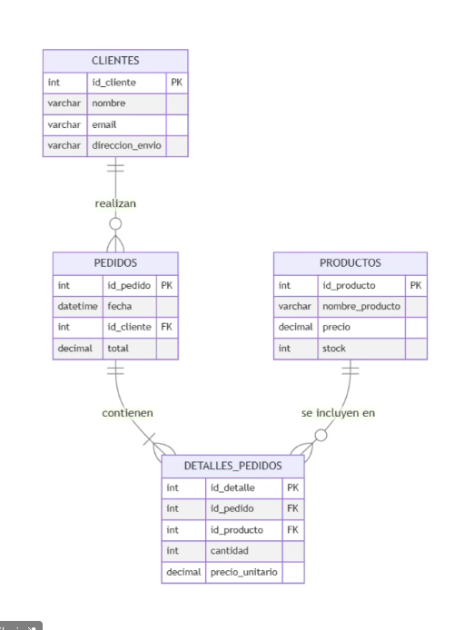

Propùesta de como seria esta tabla

para la parte de clientes 
{
  "_id": "number",
  "nombre": "string",
  "email": "string",
  "direccion_envio": "string"
},

productos 
{
  "_id":"number",
  "nombre_producto": "string",
  "precio": "number",
  "stock": "number"
},

pedidos 
{
  "_id": "number",
  "fecha": "ISODate",
  "cliente": {
    "id_cliente":"number",
    "nombre": "string" 
  },

  "detalles": [
    {
      "id_producto": "number",
      "nombre_producto": "string", 
      "cantidad": "number",
      "precio_unitario": "number"
    },
    {
      "id_producto": "number",
      "nombre_producto": "string",
      "cantidad": "number",
      "precio_unitario": "number"
    }
  ]
  "total": "number"
}